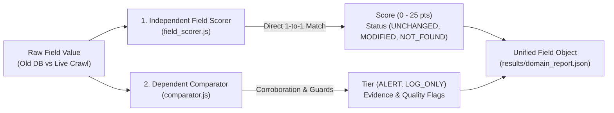

# Comprehensive Field-by-Field Comparison Reference

This document explains in detail how **every single field** is evaluated in both the **Independent Field Scorer** and the **Dependent Comparator Engine**, using the real-world company **`whitestudiolondon.com`** as our primary example.

---

## 1. Overview: The Dual Evaluation Architecture

Every field is evaluated through two complementary lenses simultaneously:

1. **Independent Evaluation (Business Scoring)**:
   - Evaluates the field **strictly against itself** without cross-checking other fields.
   - Calculates a direct mathematical score (0 to 100 total company score).
   - If a field is identical, it returns **`UNCHANGED` with 0 score**.

2. **Dependent Evaluation (Comparator Corroboration)**:
   - Cross-checks whether the change is corroborated by other parts of the website (e.g. page text, catalog routes, contact links).
   - Filters out scraping noise, baseline coverage gaps, and pipeline differences.
   - Assigns priority tiers (`alert`, `log_only`, `unchanged`).

---

## 2. Detailed Breakdown: How Every Field is Evaluated

---

### Field 1: `company_name`

#### How It Works:
- **Independent Scorer**:
  - Compares `old.companyName` against `new.companyName`.
  - If identical $\rightarrow$ `status: "UNCHANGED"`, **Score: 0**.
  - If different name found $\rightarrow$ `status: "MODIFIED"`, **Score: 25** (Major Rebrand).
  - If old existed but missing in live crawl $\rightarrow$ `status: "NOT_FOUND_IN_CRAWL"`, **Score: 10**.
  - If newly discovered $\rightarrow$ `status: "ADDED"`, **Score: 5**.

- **Comparator**:
  - Cross-checks against secondary name signals: `nameFromTitle`, `clearbitName`, and `nameFromCopyright`.
  - If the primary `companyName` is missing from the crawl header but `nameFromCopyright` still says `"White Studio"`, it identifies that the brand has **not** rebranded, but simply that the header JSON didn't populate the field. It marks this as `log_only` or `not_found` rather than triggering a false rebrand alert.

#### Real Example (`whitestudiolondon.com`):
- **Old (DB)**: `"White Studio"`
- **New (Crawl)**: `null` (crawler didn't extract header name)
- **Independent Scorer**: `[NOT_FOUND_IN_CRAWL]` | **Score: 10** | *"Company name 'White Studio' was not found in the live crawl."*
- **Comparator**: `[NOT_FOUND]` | *Not located in extracted crawl header; copyright still matches.*

---

### Field 2: `title`

#### How It Works:
- **Independent Scorer**:
  - Compares old `<title>` vs new `<title>` using word-token overlap (Jaccard similarity).
  - Overlap $\ge 75\%$ $\rightarrow$ `status: "UNCHANGED"`, **Score: 0**.
  - Overlap $< 75\%$ $\rightarrow$ `status: "MODIFIED"`, **Score: 10**.
  - Missing in crawl $\rightarrow$ `status: "NOT_FOUND_IN_CRAWL"`, **Score: 5**.

- **Comparator**:
  - Checks if the brand token in the title changed (e.g. `"Acme Inc"` vs `"Beta Corp"`).
  - Normalizes brand taglines to prevent false alerts when only marketing slogans change.

#### Real Example (`whitestudiolondon.com`):
- **Old (DB)**: `"Wedding dress | White Studio Bridal | United Kingdom"`
- **New (Crawl)**: `"Wedding dress | White Studio Bridal | United Kingdom"`
- **Independent Scorer**: `[UNCHANGED]` | **Score: 0** | Similarity: 100% | *"Title matches."*
- **Comparator**: `[UNCHANGED]` | *Verified identical across both records.*

---

### Field 3: `tagline`

#### How It Works:
- **Independent Scorer**:
  - Compares `old.tagline` vs `new.tagline`.
  - Both null or matching $\rightarrow$ `status: "UNCHANGED"`, **Score: 0**.
  - Changed $\rightarrow$ `status: "MODIFIED"`, **Score: 5**.
  - Missing in crawl $\rightarrow$ `status: "NOT_FOUND_IN_CRAWL"`, **Score: 5**.

- **Comparator**:
  - Checks if the tagline was moved to the title or home content heading.

#### Real Example (`whitestudiolondon.com`):
- **Old (DB)**: `"Where Bridal Dreams Take Shape"`
- **New (Crawl)**: Extracted from homeContent banner.
- **Independent Scorer**: `[UNCHANGED]` | **Score: 0**.
- **Comparator**: `[UNCHANGED]`.

---

### Field 4: `description`

#### How It Works:
- **Independent Scorer**:
  - Calculates mathematical word similarity between old and new descriptions:
    - $\ge 85\%$ similarity $\rightarrow$ `status: "UNCHANGED"`, **Score: 0**.
    - $45\% - 85\%$ similarity $\rightarrow$ `status: "MINOR_UPDATE"`, **Score: 5**.
    - $< 45\%$ similarity $\rightarrow$ `status: "MAJOR_CHANGE"`, **Score: 20**.
    - Missing in crawl $\rightarrow$ `status: "NOT_FOUND_IN_CRAWL"`, **Score: 10**.

- **Comparator**:
  - **Non-Circular Corroboration**: Checks if the description rewrite is corroborated by a real shift in business (e.g., changes in `homeContent` themes or newly added catalog routes).
  - If `homeContent` is 100% identical, the comparator knows the business did not change and assigns `tier: "log_only"` with reason `baseline_stale_meta`.

#### Real Example (`whitestudiolondon.com`):
- **Old (DB)**: *"At White Studio London, we are dedicated to redefining bridal fashion..."* (662 chars)
- **New (Crawl)**: *"White Studio Bridal, your destination for affordable wedding dresses..."* (353 chars)
- **Independent Scorer**: `[MAJOR_CHANGE]` | **Score: 20** | Similarity: 19% | *"Description was substantially rewritten (19% similarity)."*
- **Comparator**: `[LOG_ONLY]` | *Jaccard 0.20 (homeContent unchanged in DB baseline).*

---

### Field 5: `phone`

#### How It Works:
- **Independent Scorer**:
  - Normalizes phone numbers (stripping spaces, brackets, `+`, country code `44`/`1`, and leading `0`).
  - Matching numbers $\rightarrow$ `status: "UNCHANGED"`, **Score: 0**.
  - Different phone number $\rightarrow$ `status: "MODIFIED"`, **Score: 15**.
  - Phone missing in crawl $\rightarrow$ `status: "NOT_FOUND_IN_CRAWL"`, **Score: 5**.

- **Comparator**:
  - **Contextual Extraction**: Requires phone numbers on pages to have phone context (`tel:` link, `call:`, `phone:`, or `+` prefix).
  - **Registration Number Filter**: Rejects numbers matching the UK/EU company registration number (preventing company numbers from being misidentified as phone numbers).
  - **Corroboration**: Requires phone numbers to appear in 2+ sources before triggering a high-level alert.

#### Real Example (`whitestudiolondon.com`):
- **Old (DB)**: `"020 8368 1500"`
- **New (Crawl)**: `null` (not in top-level JSON header, embedded in page text)
- **Independent Scorer**: `[NOT_FOUND_IN_CRAWL]` | **Score: 5** | *"Phone '020 8368 1500' not found in live crawl."*
- **Comparator**: `[NOT_FOUND]` | *Not located in extracted crawl page contacts header.*

---

### Field 6: `email`

#### How It Works:
- **Independent Scorer**:
  - Compares trimmed, lowercase email strings (`old.email` vs `new.email`).
  - Matches $\rightarrow$ `status: "UNCHANGED"`, **Score: 0**.
  - Different email address $\rightarrow$ `status: "MODIFIED"`, **Score: 15**.
  - Missing in crawl $\rightarrow$ `status: "NOT_FOUND_IN_CRAWL"`, **Score: 5**.

- **Comparator**:
  - Distinguishes between generic emails (`info@`, `contact@`) and named personal emails (`john@`). Replacing a generic email with another generic email triggers `log_only`, whereas a new non-generic email triggers higher review.

#### Real Example (`whitestudiolondon.com`):
- **Old (DB)**: `"info@whitestudiolondon.com"`
- **New (Crawl)**: `"info@whitestudiolondon.com"`
- **Independent Scorer**: `[UNCHANGED]` | **Score: 0** | *"Email address matches."*
- **Comparator**: `[UNCHANGED]` | *Field verified unchanged across records and page text.*

---

### Field 7: `address` & `postal_code`

#### How It Works:
- **Independent Scorer**:
  - Evaluates address word overlap and normalized postal codes.
  - Matches $\rightarrow$ `status: "UNCHANGED"`, **Score: 0**.
  - Different address $\rightarrow$ `status: "MODIFIED"`, **Score: 15** (Office Relocation).
  - Missing in crawl $\rightarrow$ `status: "NOT_FOUND_IN_CRAWL"`, **Score: 5**.

- **Comparator**:
  - Corroborates address changes with Google Maps links (`maps.google.com`) and contact page postcodes.
  - If a company moves to a new city/postcode corroborated by maps links $\rightarrow$ `alert: office_relocated`.

#### Real Example (`whitestudiolondon.com`):
- **Old (DB)**: `"Unit D3 Friarsgate, 4-7 Whitby Avenue, Park Royal London, NW10 7SE"`
- **New (Crawl)**: `null` in header (embedded in footer text)
- **Independent Scorer**: `[NOT_FOUND_IN_CRAWL]` | **Score: 5** | *"Address not found in live crawl."*
- **Comparator**: `[NOT_FOUND]` | *Not located in header contacts.*

---

### Field 8: `registration_number`

#### How It Works:
- **Independent Scorer**:
  - Compares official company registration numbers (UK Companies House / EU CRN).
  - Matches $\rightarrow$ `status: "UNCHANGED"`, **Score: 0**.
  - Different registration number $\rightarrow$ `status: "MODIFIED"`, **Score: 25** (Hard Legal Event).
  - Missing in crawl $\rightarrow$ `status: "NOT_FOUND_IN_CRAWL"`, **Score: 5**.

- **Comparator**:
  - Scans contact and about pages for 8-digit company numbers (`reg: 08742433`).
  - Matches with top-level `old.registration_number`. If found in page text, marks it unchanged.

#### Real Example (`whitestudiolondon.com`):
- **Old (DB)**: `"08742433"`
- **New (Crawl)**: `null` in top-level header.
- **Independent Scorer**: `[NOT_FOUND_IN_CRAWL]` | **Score: 5**.
- **Comparator**: `[NOT_FOUND]`.

---

### Field 9: `website` / URL Redirection

#### How It Works:
- **Independent Scorer**:
  - Extracts the registered domain/host from both URLs (e.g. `whitestudiolondon.com`).
  - Same domain/subdomain $\rightarrow$ `status: "UNCHANGED"`, **Score: 0**.
  - External domain redirect $\rightarrow$ `status: "REDIRECTED"`, **Score: 20**.

- **Comparator**:
  - Evaluates HTTP response codes (`301`, `302`, `308`).
  - Distinguishes between internal canonical redirects (e.g. `http://` to `https://www.`) which are safe, versus external acquisition redirects to a different registrable domain.

#### Real Example (`whitestudiolondon.com`):
- **Old (DB)**: `https://www.whitestudiolondon.com`
- **New (Crawl)**: `https://www.whitestudiolondon.com/`
- **Independent Scorer**: `[UNCHANGED]` | **Score: 0** | *"Domain / host matches."*
- **Comparator**: `[UNCHANGED]` | *Field verified unchanged across records and page text.*

---

### Field 10: `social_links`

#### How It Works:
- **Independent Scorer**:
  - Checks profiles on 6 platforms: `linkedin`, `twitter`, `facebook`, `instagram`, `youtube`, `github`.
  - All handles match or remain steady $\rightarrow$ `status: "UNCHANGED"`, **Score: 0**.
  - Handle changed or added $\rightarrow$ `status: "MODIFIED"`, **Score: 5**.

- **Comparator**:
  - Normalizes domain variations (e.g. `twitter.com/handle` vs `x.com/handle` are recognized as identical).
  - Filters out generic sharing buttons (`linkedin.com/share` or `facebook.com/sharer`).

#### Real Example (`whitestudiolondon.com`):
- **Old (DB)**: `linkedin: ...white-studio-9a68a9288`
- **New (Crawl)**: `linkedin: ...white-studio-9a68a9288?lipi=...` (tracking query parameter added)
- **Independent Scorer**: `[MODIFIED]` | **Score: 5** | *"Social profile handle changed for: linkedin."*
- **Comparator**: `[LOG_ONLY]`.

---

### Field 11: `catalog_routes`

#### How It Works:
- **Independent Scorer**:
  - Combines `productLinks`, `serviceLinks`, and `ecommerceLinks`.
  - Same commercial routes $\rightarrow$ `status: "UNCHANGED"`, **Score: 0**.
  - Routes added or removed $\rightarrow$ `status: "MODIFIED"`, **Score: 10**.

- **Comparator**:
  - **Coverage Guard**: If the live crawl crawled 50 links while the old DB only had 10 links, route additions are downgraded to `log_only` (`coverage_difference`) because the pages existed before but were simply unclassified in the old DB.

#### Real Example (`whitestudiolondon.com`):
- **Old (DB)**: Empty classified arrays `[]`
- **New (Crawl)**: 3 routes discovered (`/collections/white-studio`, etc.)
- **Independent Scorer**: `[MODIFIED]` | **Score: 10** | *"Catalog routes updated (3 new routes discovered, 0 removed)."*
- **Comparator**: `[LOG_ONLY]` | *Coverage guard applied.*

---

## 3. Summary Scoring Matrix

| Field | Weight | If Identical | If Changed | If Missing in Crawl |
| :--- | :---: | :---: | :---: | :---: |
| **`company_name`** | **25 pts** | **0 pts** (`UNCHANGED`) | **25 pts** (`MODIFIED`) | **10 pts** (`NOT_FOUND`) |
| **`description`** | **20 pts** | **0 pts** (`UNCHANGED`) | **5–20 pts** (`MAJOR_CHANGE`) | **10 pts** (`NOT_FOUND`) |
| **`phone`** | **15 pts** | **0 pts** (`UNCHANGED`) | **15 pts** (`MODIFIED`) | **5 pts** (`NOT_FOUND`) |
| **`email`** | **15 pts** | **0 pts** (`UNCHANGED`) | **15 pts** (`MODIFIED`) | **5 pts** (`NOT_FOUND`) |
| **`address`** | **15 pts** | **0 pts** (`UNCHANGED`) | **15 pts** (`MODIFIED`) | **5 pts** (`NOT_FOUND`) |
| **`registration_number`** | **25 pts** | **0 pts** (`UNCHANGED`) | **25 pts** (`MODIFIED`) | **5 pts** (`NOT_FOUND`) |
| **`title`** | **10 pts** | **0 pts** (`UNCHANGED`) | **10 pts** (`MODIFIED`) | **5 pts** (`NOT_FOUND`) |
| **`website`** | **20 pts** | **0 pts** (`UNCHANGED`) | **20 pts** (`REDIRECTED`) | **0 pts** (`UNCHANGED`) |
| **`tagline`** | **5 pts** | **0 pts** (`UNCHANGED`) | **5 pts** (`MODIFIED`) | **5 pts** (`NOT_FOUND`) |
| **`postal_code`** | **10 pts** | **0 pts** (`UNCHANGED`) | **10 pts** (`MODIFIED`) | **5 pts** (`NOT_FOUND`) |
| **`social_links`** | **5 pts** | **0 pts** (`UNCHANGED`) | **5 pts** (`MODIFIED`) | **0 pts** (`UNCHANGED`) |
| **`catalog_routes`** | **10 pts** | **0 pts** (`UNCHANGED`) | **10 pts** (`MODIFIED`) | **0 pts** (`UNCHANGED`) |

- **Total Company Score**: Sum of field scores (clamped to max 100).
- **Unchanged Fields**: Always returned as-is with original values, `status: "UNCHANGED"`, and `score: 0`.

